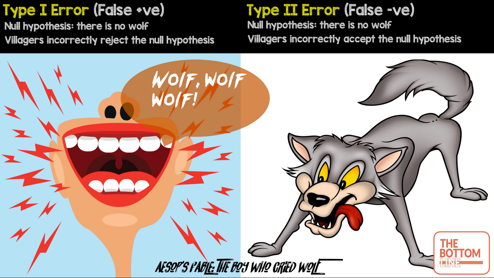
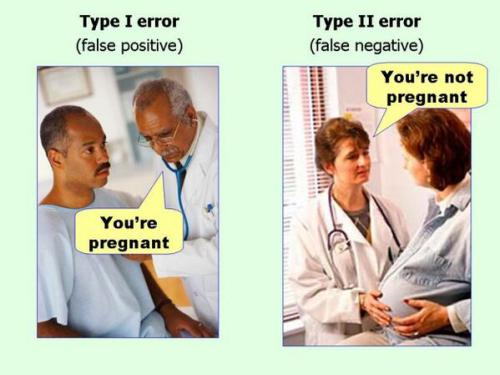
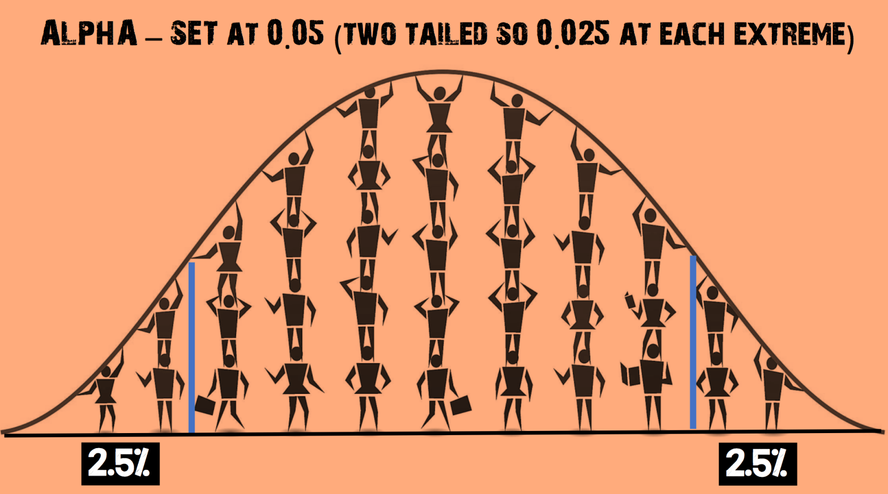
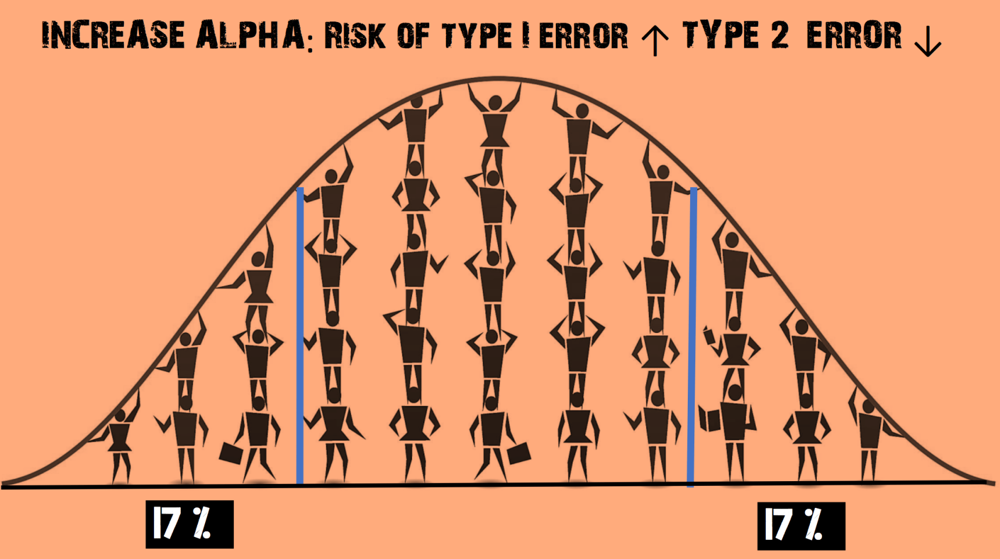
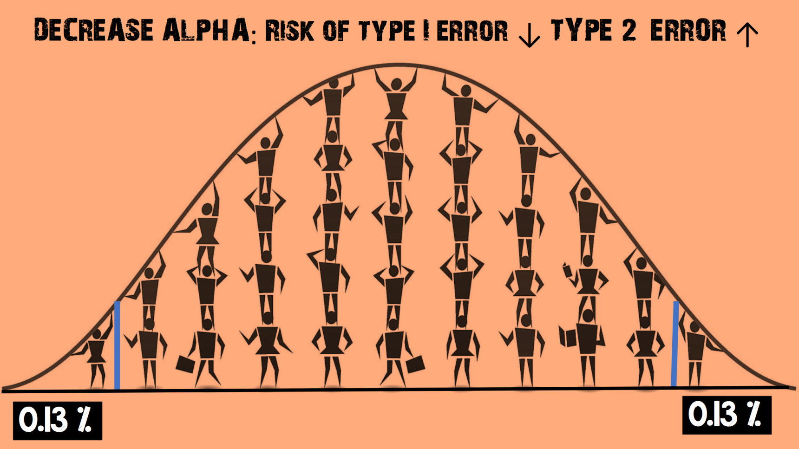

# Statistical_Errors
Type I and II errors in hypothesis testing.

SWBATS

### Statistical Errors - An analogy from Aesop's Fables

Let's think of Aesop's Fable about the boy and the wolf. 

A little boy is protecting a flock of his sheep from wolves. If a wolf comes, he is supposed to cry “WOLF”, so that the men from the village can come and stop the wolf from attacking the flock. A few days pass and the boy is bored as no wolf ever comes. For a bit of fun, he pretends that a wolf has arrived and attacking the sheep. So he cries out loud "WOLF", as he is supposed to do. 

For the villagers

>The Null Hypothesis is that there is no wolf.
>the Alternative Hypothesis is that there is a wolf. 

Villagers come running to save the sheep, but don't see any wolf. The boy laughs at them and tells them that he played a trick on them just for fun. 

>A "TYPE I" or "FALSE POSITIVE" error has occurred (i.e. rejecting the Null Hypothesis when it is true i.e. villagers believing the boy when there was no wolf)

The boy enjoys this very much, so he repeats this again and villagers come running as they did before. All the villagers get really angry and decide not to believe him again. 

After some time a wolf really does attack. The boy cries “WOLF” but no one comes for help, thinking that he is playing the trick again. The wolf attacks and kills all the sheep. 

>A "TYPE II" or "FALSE NEGATIVE" error has occurred. (i.e. accepting Null Hypothesis when it is actually false i.e. e.g villagers not believing the boy when there actually was a wolf)

Another rather funny way to remember Type 1 and 2 errors: 

[More examples](https://en.wikipedia.org/wiki/Type_I_and_type_II_errors#Example_1) of false positive and negative from Wikipedia.  

#

### ALPHA and BETA 

**Alpha (α):** is the probability of a type I error i.e. finding a difference when a difference does not exist. 

Most medical literature uses an alpha cut-off of 5% (0.05), indicating a 5% chance that a significant difference is actually due to chance and is not a true difference. 

**Beta (β):** is the probability of a type II error i.e. not detecting a difference when one actually exists. 

Beta is directly related to study power (Power = 1 – β) which we shall see in the next lesson. Most medical literature uses a beta cut-off of 20% (0.2), indicating a 20% chance that a significant difference is missed. 

#

### Why is an α level of 0.05 chosen as a cut-off for statistical significance?

The α level of 0.05 is considered the best balance to avoid excessive type I or type II errors as shown below: 

IF we decide the value of alpha to say .35 i.e. 35%, the cut-off points will look as shown below:

* This increases the chance of rejecting the null hypothesis
* The risk of a Type II error (false negative) is REDUCED
* But the risk of a Type I error (false positive) is INCREASED

similarly, if we decide to use a very small value of alpha, it'll change the outcome as follows:

* This increases the chance of accepting the null hypothesis
* The risk of a Type I error (false positive) is REDUCED
* But the risk of a Type II error (false negative) is INCREASED

From above, we can see that in statistical hypothesis testing, the more we try and avoid a Type I error (false positive), the more likely a Type II error (false negative) will occur. 

Researchers have found that an alpha level of 5% provides a good balance. 
[Here](https://shiny.rit.albany.edu/stat/betaprob/) is an excellent tool to visualize type 1 and two errors. 

